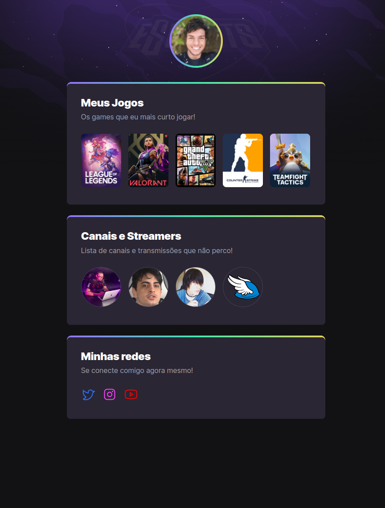

# **NLW eSports - Trilha Explorer**
> Projeto construído no evento Next Level Week da Rocketseat. O evento ocorreu no ano de 2022 entre os dias 11 de Setembro até 18 de Setembro.



>### [📎 Clique aqui para acessar o projeto](https://danieldemoura.github.io/NLW-eSports-2022/)
</br>

## 🛠️ **Tecnologias utilizadas**
- HTML
- CSS

## 🧰 **Ferramentas Utilizadas**
- Google Chromium
- Visual Studio Code
- Figma

## 💻️ **AULAS**
- ### Aula 01: 
    - Apresentação das ferramentas e configuração do ambiente de desenvolvimento.

- ### Aula 02: 
    - Introdução ao HTML, o que é HTML?, Hypertext, Markup e Sintaxe de uma tag.

- ### Aula 03: 
    - Introdução ao CSS, o que é CSS?, Declaration, Comentários, Cascading, Specificity e Box Model.

- ### Aula 04: 
    - Introdução ao GitHub, o que é GitHub?

- ### Aula 05: 
    - Upload do projeto no GitHub.

## 📝 **O que aprendi?**
> Com certeza, o que eu mais gostei e que eu não sabia fazer era fazer e aplicar transição e animações nos elementos. 
- `transform: scale(1.2);` A gente utilizou a propriedade transform mais o valor scale() para fazer a transformação do elemento, aumentar o seu tamanho. 
- `transition: transform .7s;` utilizamos a propriedade transition onde achamamos o transform e aplicamos .7s, que é o tempo de duração da transição.

> Agora a animação fizemos assim:
```
@keyframes fromBottom { 
    from { 
        opacity: 0; 
        transform: translateX(-400px);
        }

    to {
        opacity: 0;
        transform: translateX(0);
    }
}
```
- Nos elementos que iriam receber a animação, aplicamos a propriedade `transition: fromBottom .5s backwards`, onde achamamos o nome da animação e aplicamos a duração de .5s, e aplicamos o valor backwards para que a animação ocorrece antes da propriedade animation-delay.

</br>

#  👤 **Contato**
[](https://www.linkedin.com/in/daniel-de-moura-silva-a123a724b/)

